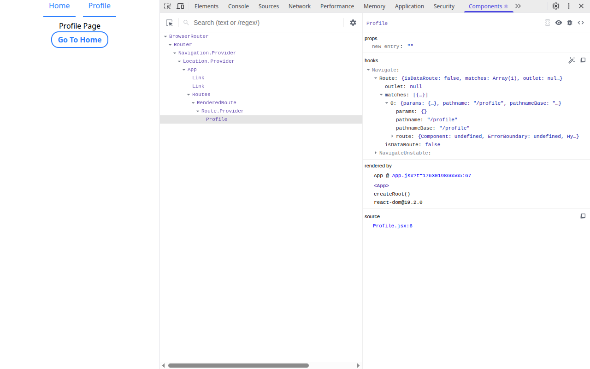

#### Which extensions did you install? Why?
- React Dev Tools : Inspect React componenets
- JSON Viewer : Visualize API json data
- Redux Dev Tools : Analyze state stores
- LightHouse : Analyze web performance , SEO and Accessability
  
#### What was the most useful thing you learned?
How to inspect each react component and know its props , callbacks , hooks and more.

#### Here it is a screenshot of react dev tools in action :-

This images shows to inspect the Profile component which uses a navigate hook , I have used it to inspect navigate hook attributes.
