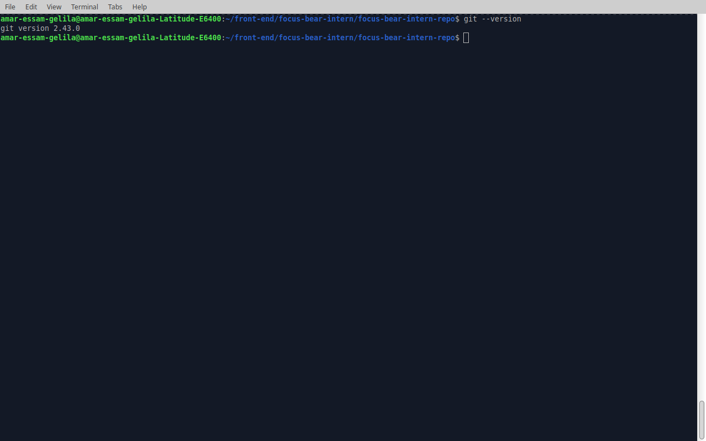

## Reflection

#### Have you used Git before? If so, in what context?
Yes , frontend web development check this repo [snkr](https://github.com/AmarGelila/snkr)

#### Which Git client (if any) did you choose? Why?
Git in VScode , as I already use VScode so find it easier and also as it makes handling conflicts easier and smooth.

#### What was the most interesting thing you learned about Git today?
I have learned about Pull Requests and why they are important when working in a team and for code review , 
as it enables only merges the code after being reviewd by seniors or teamlead.

#### here it is a screenshot of my git version :-

