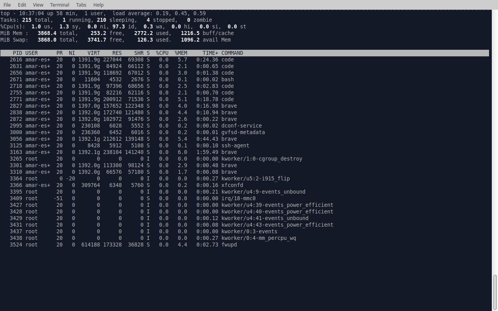

## Reflection
#### Which terminal client did you choose? Why?
Xfce Terminal , as it is the defualt terminal for my linux distro.

#### What customizations (if any) did you make?
I have made no customizations , but if I can able to always open in fullscreen I will do it.

#### What was the most useful command you learned today?
top , which displays all currently running process and memory and CPU usage stats
it helps me recognize if there is any tasks run that I do not about and here it is a screenshot of a use of it :-

