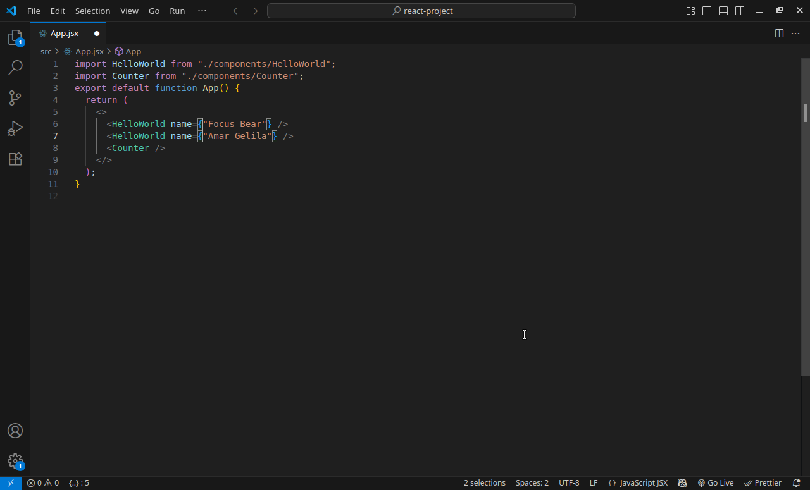
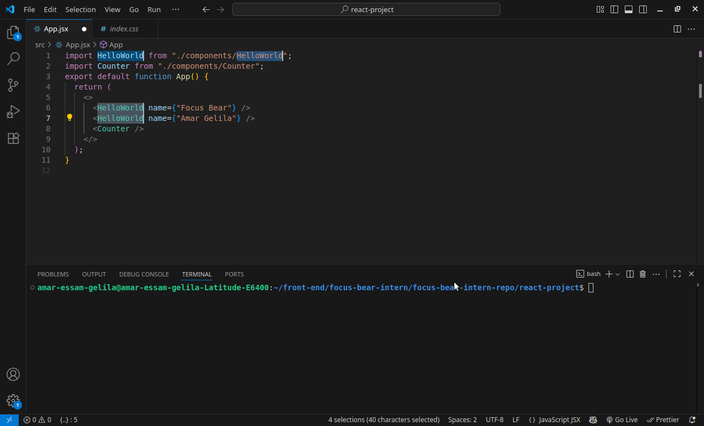

## Reflection

#### Top 10 shortcuts:-
- Navigation
    1. CTRL + B : Toggles sidebar
    2. CTRL + p : Quick open
    3. CTRL + PageUP|PageDown : Toggles editor tabs     
- Editing
    1. CTRL + SHIFT + L : Select all occurences
    2. CTRL + SHIFT + K : Delete the current line
    3. CTRL + / : Line Comment
    4. CTRL + SHIFT + F : Seacrh across all files
    5. CTRL + SHIFT + H : Find and Replace across all files
    6. CTRL + Right Click : Add multiple cursors
- Debugging
    1. F5 : Start | Continue
    2. F10 : Step over current breakpoint
    3. SHIFT + F11 : Step out current breakpoint
       
- Terminal
    1. CTRL + ` : Toggles terminal
    2. CTRL + SHIFT + J : Toggles foucs between editor and terminal
    3. cd : change directory
    4. code <file | directory> : open <file | directory> with vscode
    5. yarn dev
      

#### Which shortcuts do you think will be the most useful in your daily work?
- CTRL + C
- CTRL + V
- CTRL + B
- CTRL + /
- CTRL + SHIFT + H
- CTRL + SHIFT + F

#### How can keyboard shortcuts improve your productivity?
- Add tailwind classes to multiple elements with SHIFT + CTRL + <UP | DOWN>
- Search for a specific variable occurences across project with CTRL + SHIFT + F
- Navigation Shortucts make toggling between style and .jsx file fast and smooth
- Editing Shortcuts saves time and limit repeated edits
- Debugging Shortcuts helps move quickly cross breakpoints
- Terminal shortcut are essential as there are some process can not done witout terminal

  
  
